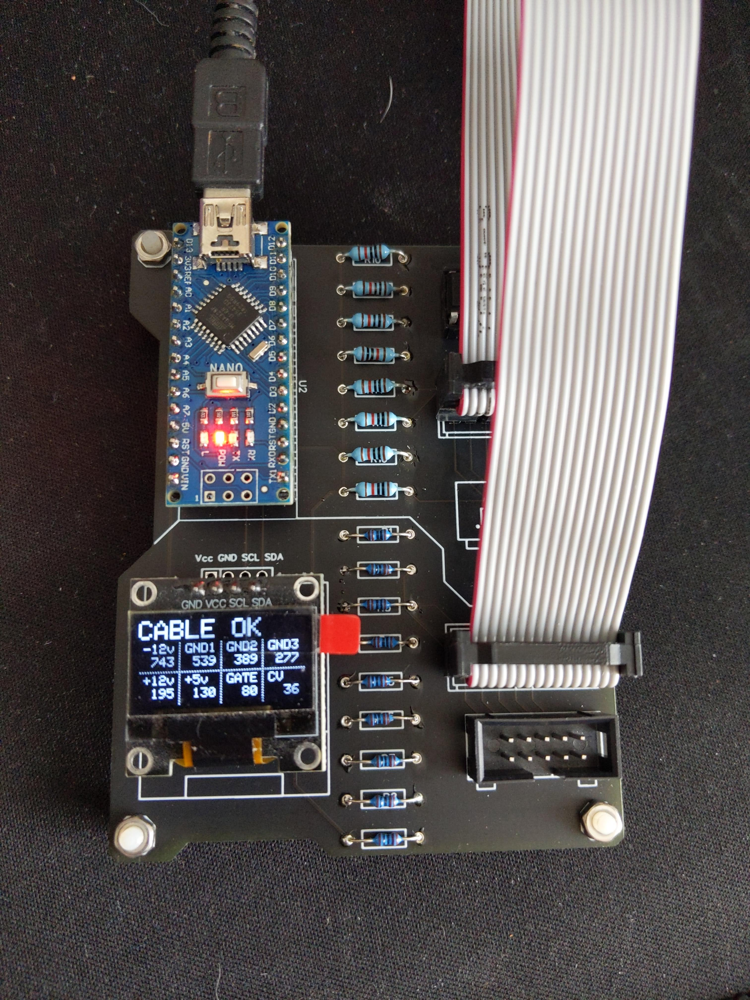
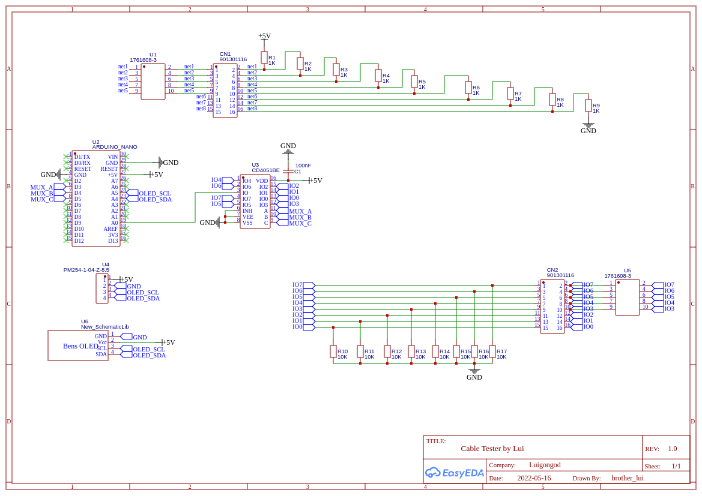

Eurorack Arduino 10/16 pin IDC Power Cable Tester
=================================================

Forked from [holmesrichards](https://github.com/holmesrichards/cabletester) Original idea and testing algorithm goes to [tomarus](https://github.com/tomarus/cabletester ). This version has a new PCB and Some modifications to the FW made into a Platformio project.

* It only tests (max) 8 wires because of how they're wired in eurorack.
* It can detect shorted cables or faulty/unconnected wires.
* Possible to run a _calibration_ sketch for more accurate readings.
* `GND-VCC-SCL-SDA` and `VCC-GND-SCL-SDA` Oled configuration allowed.
* JLCPCB Gerber ready zip

The original documentation and repo information is under _OGs_ folder. Gerbers, schematics and BOM are under _HW_ while the Platformio project is under _FW_.

# Calibration

Default values should work fine:
```
const int expect[] = {746, 544, 395, 286, 204, 130, 80, 35};
```
But is recommended to make a _calibration_ run to change to proper values. To do that:
- Define `DEBUG` mode by uncommenting line 7. 
- Plug a 16 pin Cable that is known to be work fine. 
- Flash the arduino and open Serialmonitor. the `expect` values will be printed, they should not differ too much from default values. 
- Change the `expect` values, comment the `DEBUG` define and re-flash



# Schematics


